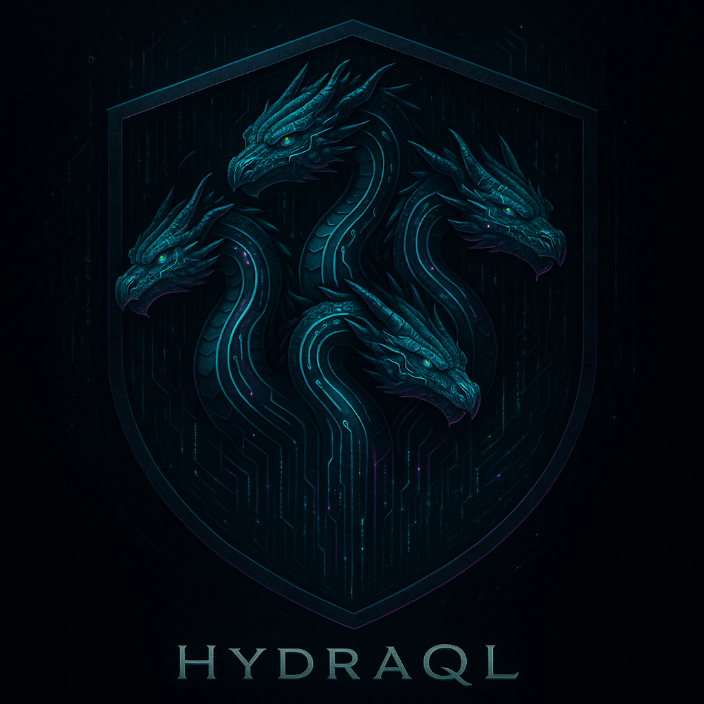

# HydraQL

[](https://github.com/gbiagomba/hydraql/actions/workflows/ci-release.yml)

## Background / Lore
**HydraQL** is a parallel CodeQL scanning engine — many-headed like the Hydra 🐍.  
It runs CodeQL queries against multiple databases, in parallel, across multiple languages, and merges results into CSV, JSON, or SARIF outputs.

Born from the need to scale CodeQL analysis across large, multi-language codebases, HydraQL aims to be fast, flexible, and mythic.

---

## Table of Contents
- [Features](#features)
- [Installation](#installation)
  - [Pre-built Binary](#pre-built-binary-recommended)
  - [Build from Source](#build-from-source)
  - [Docker](#docker)
  - [Python Legacy](#python-legacy)
- [Usage](#usage)
  - [Flag Reference](#flag-reference)
  - [Examples](#examples)
- [CI / Release](#ci--release)
- [Contributing](#contributing)
- [License](#license)

---

## Features
- 🦫 **Single Go binary** — no runtime dependencies; one file per platform
- 🔥 Parallel query execution (`-t 8` / `--threads 8`)
- 📦 Optional `codeql pack install` (`-P` / `--pack-install`)
- 🧩 Multiple query directories (comma-separated or repeated `-q`)
- 🐍 Language aliasing (TypeScript→JavaScript, Kotlin→Java, Go→Go)
- 🛡️ Database preflight: presence, finalization, structure, and emptiness checks
- 🔒 IMB cache lock detection and auto-removal (`-u` / `--unlock-cache`)
- 🔧 DB automation: auto-finalize (`-F`) and auto-init (`-i`) with `--source-root`
- 🎨 Fancy colored output and ASCII summary chart (`-f` / `--fancy`)
- 🔍 Severity filtering with strict or loose matching (`-s HIGH`)
- 📊 Outputs in CSV, JSON, or SARIF (`-o sarif`)
- ⏱️ Per-query timeout (`-T 600`) with real-time progress ticker — never hang on slow suites
- 🚀 GitHub Actions CI: cross-compile, release, and Docker publish on tag

---

## Installation

### Pre-built Binary (recommended)

Download the binary for your platform from [Releases](https://github.com/gbiagomba/hydraql/releases):

| Platform       | Binary                         |
|----------------|--------------------------------|
| macOS (Apple)  | `hydraql-darwin-arm64`         |
| macOS (Intel)  | `hydraql-darwin-amd64`         |
| Linux x86-64   | `hydraql-linux-amd64`          |
| Linux ARM64    | `hydraql-linux-arm64`          |
| Windows x86-64 | `hydraql-windows-amd64.exe`    |
| Windows ARM64  | `hydraql-windows-arm64.exe`    |

```bash
# macOS / Linux
chmod +x hydraql-darwin-arm64
./hydraql-darwin-arm64 --version

# or rename for convenience
mv hydraql-darwin-arm64 hydraql && ./hydraql --help
```

### Build from Source

**Prerequisites:** Go 1.26+, CodeQL CLI in `$PATH`

```bash
# One-liner global install (Go 1.26+)
go install github.com/gbiagomba/hydraql/v2/cmd/hydraql@latest

# Or clone and build manually
git clone https://github.com/gbiagomba/hydraql.git
cd hydraql

make build          # native binary → ./hydraql
make build-all      # all 6 platform binaries → dist/
make go-test        # run tests
make go-vet         # run go vet
```

### Docker

```bash
# Build image (compiles Go binary inside Docker)
docker build -t hydraql:latest .

# With a specific CodeQL CLI version
docker build --build-arg CODEQL_VERSION=2.17.6 -t hydraql:latest .

# Run
docker run --rm \
  -v "$PWD/cqlDB:/app/cqlDB" \
  -v "$HOME/Git/codeql:/app/queries:ro" \
  hydraql:latest \
  --db-root /app/cqlDB \
  --langs "javascript,typescript,python,java" \
  --query-dir /app/queries \
  --output-format sarif \
  --fancy
```

### Python (legacy)

The original Python implementation lives in `legacy/` and remains functional at the v1.8.0 feature level.

```bash
# Prerequisites: Python 3.7+, CodeQL CLI in PATH
python3 legacy/hydraql.py --help

# Or via Makefile
make run
```

---

## Usage

### Flag Reference

All flags support both a short form (`-X`) and the traditional long form (`--flag-name`).

| Short | Long                    | Default   | Description                                            |
|-------|-------------------------|-----------|--------------------------------------------------------|
| `-d`  | `--db-root`             | `cqlDB`   | Root of CodeQL databases (`<db-root>/<lang>/codeql-database.yml`) |
| `-l`  | `--langs`               | `java,javascript,typescript,python` | Comma-separated languages to scan |
| `-q`  | `--query-dir`           | `~/Git/codeql` | Query directory (repeat or comma-separate for multiple) |
| `-t`  | `--threads`             | `6`       | Parallel worker count (alias: `--parallel`)            |
| `-o`  | `--output-format`       | `csv`     | Output format: `csv`, `json`, `sarif`                  |
| `-s`  | `--severity`            | _(none)_  | Filter findings by severity (e.g. `HIGH`, `CRITICAL`)  |
| `-S`  | `--strict-severity`     | `false`   | Exact severity match (no loose mapping)                |
| `-f`  | `--fancy`               | `false`   | Colored output + ASCII chart                           |
| `-v`  | `--verbose`             | `false`   | Verbose command logging and error details              |
| `-n`  | `--dry-run`             | `false`   | Print commands without executing                       |
| `-P`  | `--pack-install`        | `false`   | Run `codeql pack install` before scanning              |
| `-m`  | `--allow-missing-db`    | `false`   | Continue if some DBs are missing or unfinalized        |
| `-x`  | `--suite-only`          | `false`   | Run only `.qls` suites; skip individual `.ql` files    |
| `-u`  | `--unlock-cache`        | `false`   | Delete stale IMB cache `.lock` files                   |
| `-c`  | `--check-lock-process`  | `false`   | Inspect PID inside any cache `.lock` file              |
| `-k`  | `--kill-lock-process`   | `false`   | **DANGER:** `kill -9` the PID found in the cache lock  |
| `-F`  | `--auto-finalize-db`    | `false`   | Automatically finalize unfinalized DBs (idempotent)    |
| `-i`  | `--auto-init-db`        | `false`   | Create missing DBs (requires `--source-root`)          |
| `-r`  | `--source-root`         | _(none)_  | Source root path for `--auto-init-db`                  |
| `-R`  | `--force-scan-unready`  | `false`   | Scan DBs that appear empty or unusable                 |
| `-T`  | `--query-timeout`       | `600`     | Per-query timeout in seconds (`0` = no timeout)        |
| `-N`  | `--no-timeout`          | `false`   | Disable per-query timeout entirely                     |
| `-V`  | `--version`             | —         | Print version and exit                                 |

### Examples

```bash
# Full scan — real-world AEM codebase (long flags)
./hydraql \
  --db-root ./cqlDB_AEM \
  --langs "java,javascript,typescript,python,cpp,go,kotlin,csharp" \
  --query-dir "~/Git/codeql,~/Git/exiv2,~/Git/CodeQL-Community-Packs" \
  --auto-finalize-db --allow-missing-db \
  --unlock-cache --check-lock-process \
  --fancy --verbose

# Same command with short flags
./hydraql \
  -d ./cqlDB_AEM \
  -l "java,javascript,typescript,python,cpp,go,kotlin,csharp" \
  -q "~/Git/codeql,~/Git/exiv2,~/Git/CodeQL-Community-Packs" \
  -F -m -u -c -f -v

# SARIF output, 8 parallel workers
./hydraql -d ./cqlDB -l "java,javascript" -q ~/Git/codeql -o sarif -t 8 -f

# Filter to HIGH and CRITICAL findings only
./hydraql -d ./cqlDB -l "java" -q ~/Git/codeql -s HIGH -f

# Strict severity match (no loose mapping)
./hydraql -d ./cqlDB -l "java" -q ~/Git/codeql -s CRITICAL -S

# Large suite — extend timeout to 30 minutes
./hydraql -d ./cqlDB -l "javascript" -q ~/Git/codeql -T 1800 -f

# Disable timeout for known-slow suites
./hydraql -d ./cqlDB -l "javascript" -q ~/Git/codeql -N -f

# Dry run — see what would execute without running CodeQL
./hydraql -d ./cqlDB -l "java" -q ~/Git/codeql -n -v

# Docker run
docker run --rm \
  -v "$PWD/cqlDB:/app/cqlDB" \
  -v "$HOME/Git/codeql:/app/queries:ro" \
  hydraql:latest \
  -d /app/cqlDB -l "javascript,java" -q /app/queries -o sarif -f
```

---

## CI / Release

On every push, GitHub Actions runs:
- `go vet`, `go build`, `go test` on ubuntu, macos-13, macos-14, and windows

On a `v*` tag push:
- Cross-compiles all 6 binaries via `make build-all`
- Generates SHA-256 checksums for each binary
- Publishes a GitHub Release with binaries and checksums
- Builds and pushes a multi-arch Docker image (`linux/amd64`, `linux/arm64`)

To publish a release:
```bash
git tag -a v2.1.0 -m "Release v2.1.0"
git push origin v2.1.0
```

Docker Hub publishing requires `DOCKER_USERNAME` and `DOCKER_PASSWORD` secrets set in the repository settings.

---

## Contributing

PRs are welcome! Ideas include:
- Additional language support and aliases
- Plugin system for custom report exporters
- SARIF upload to GitHub Code Scanning via the existing CI workflow

---

## License

This project is licensed under the GPL-3.0 License.  
See the [LICENSE](LICENSE) file for details.
